Прогнозирование охвата рекламных объявлений в Telegram

Решение задачи по разработке ML-модели для прогнозирования количества просмотров (VIEWS) рекламных объявлений в Telegram на основе CPM, канала размещения и даты.

## Описание проекта

Проект представляет собой веб-сервис с REST API, который позволяет прогнозировать охват рекламного объявления до его запуска. Модель обучена на исторических данных за два года и использует следующие входные параметры:

- CPM (Cost Per Mille) - стоимость за тысячу показов
- CHANNEL_NAME - идентификатор канала размещения
- DATE - дата размещения объявления

Структура проекта

```
.
├── AllData.csv                 # Обучающий датасет
├── TestDataset.csv             # Тестовый датасет для заполнения
├── eda.py                      # Скрипт для исследовательского анализа данных
├── train_model.py              # Скрипт для обучения модели
├── api.py                      # REST API сервис (Waitress)
├── test_api.py                 # Тестирование API
├── predict_test_dataset.py     # Обработка тестового датасета
├── example_usage.py            # Примеры использования API
├── requirements.txt            # Зависимости проекта
├── model_cb.pkl                # Обученная модель CatBoost
├── label_encoders.pkl          # Энкодеры для категориальных признаков
├── feature_names.pkl           # Список признаков модели
├── model_metrics.txt           # Метрики качества модели
└── README.md                   # Документация
```

Примечание: Система использует `AllData.csv` для обучения.

## Демо (Render)

Сервис развернут в облаке:  
https://telegram-views-api.onrender.com

## Скриншоты

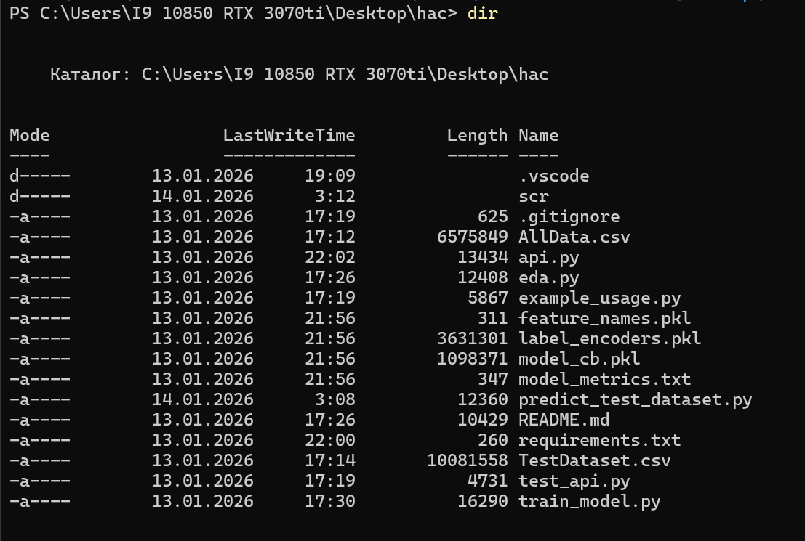
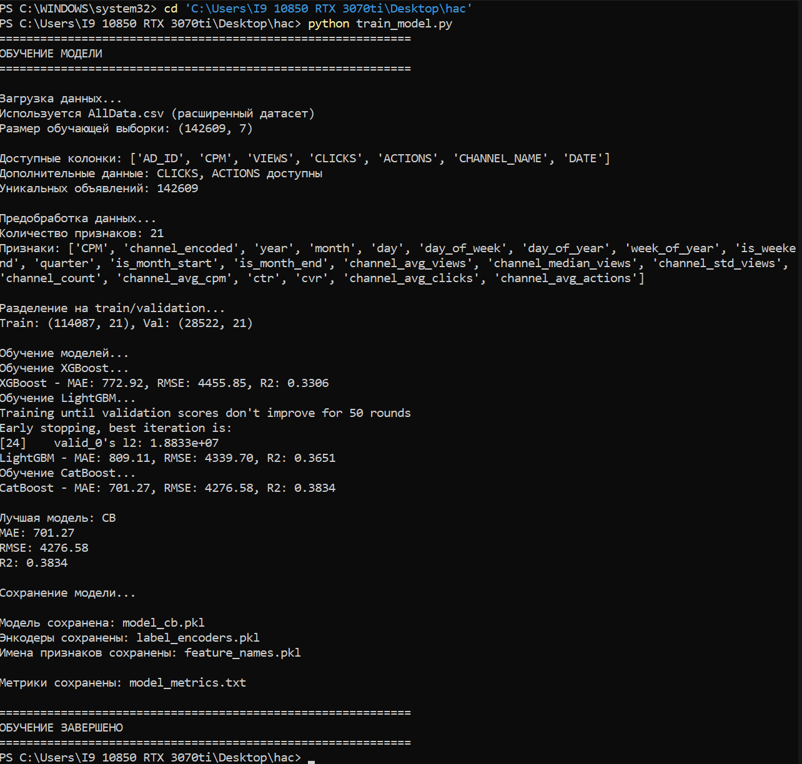
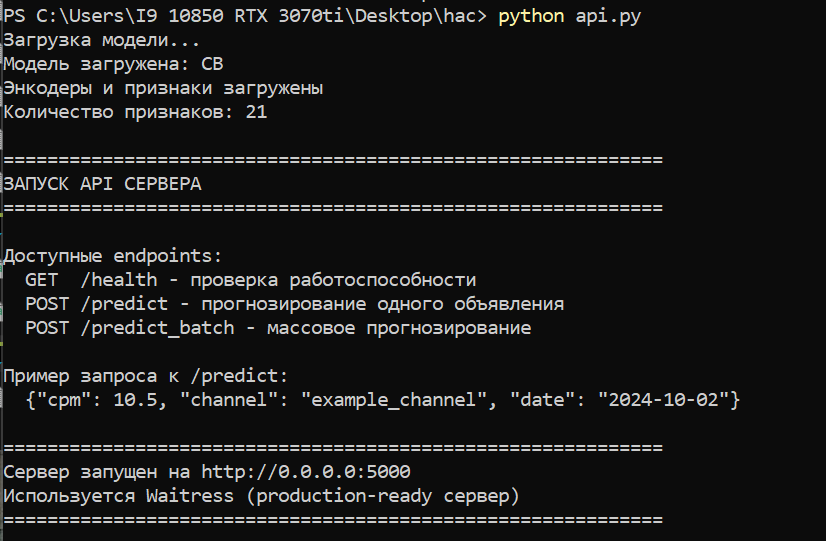
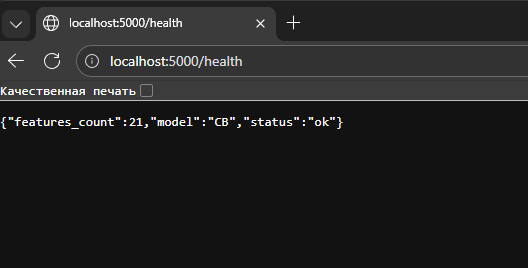
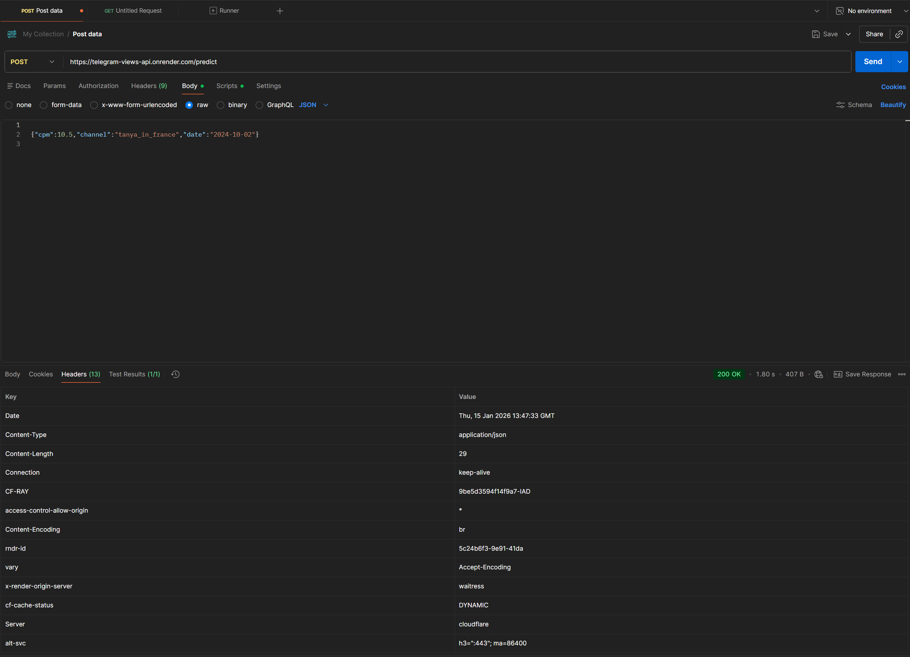
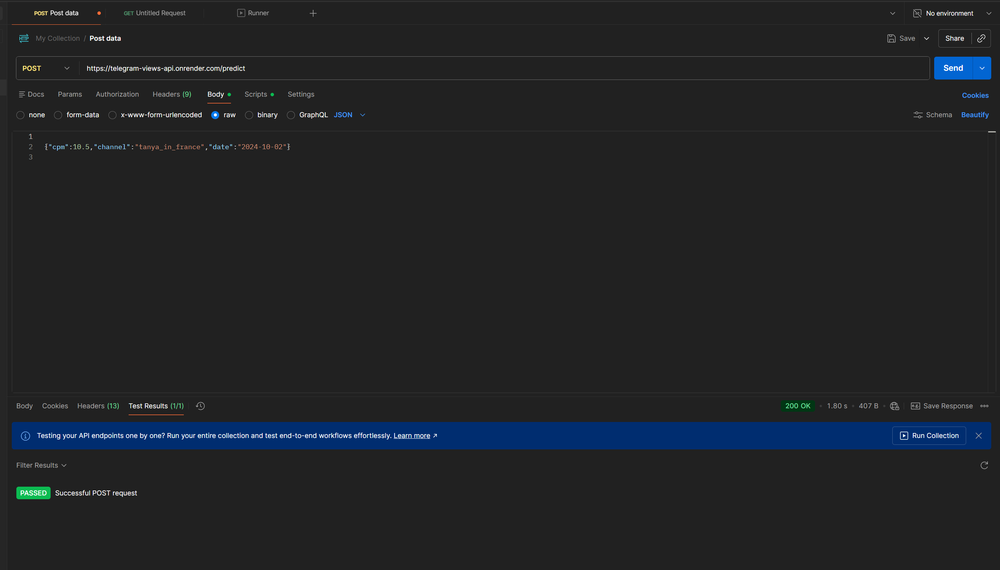
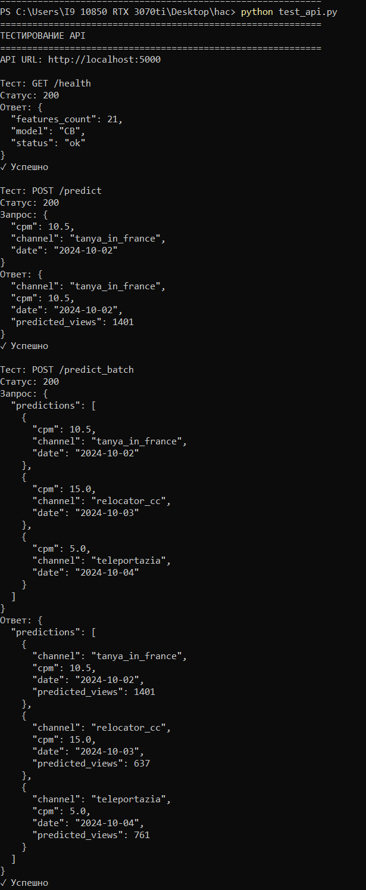
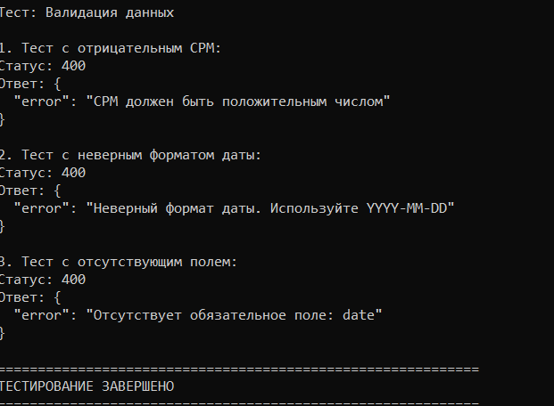
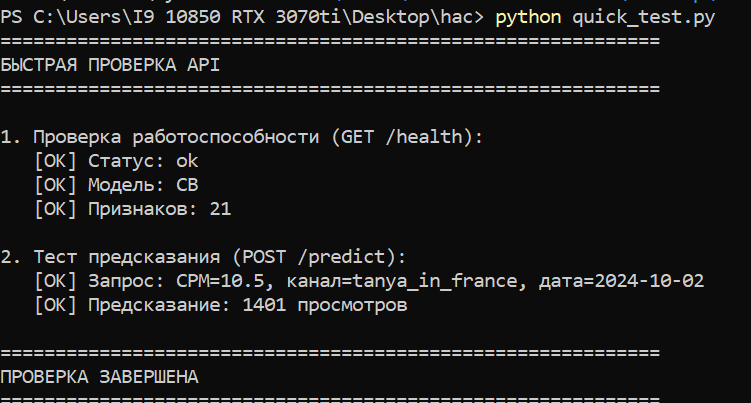
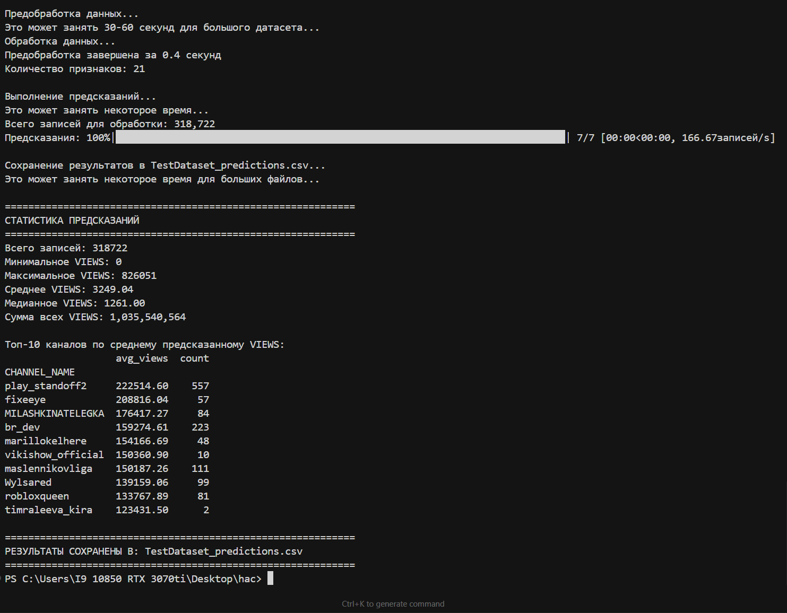
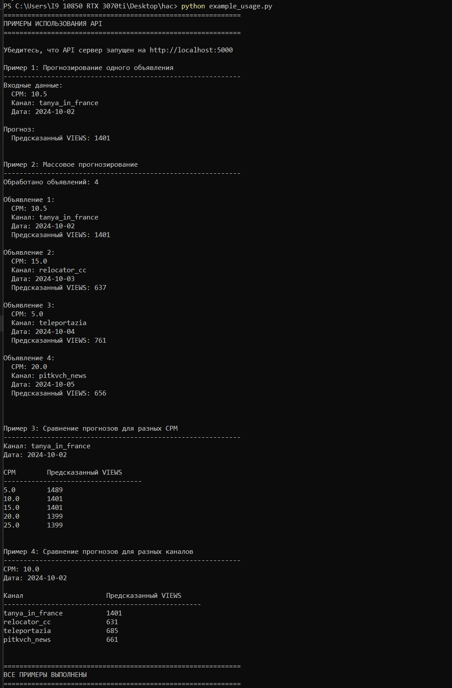

Быстрый старт

```bash
1. Установка зависимостей
python -m pip install -r requirements.txt

2. Обучение модели (может занять несколько минут)
python train_model.py

3. Запуск API сервера
python api.py

4. В другом терминале - тестирование API
python test_api.py
```

Установка и запуск

1. Установка зависимостей

```bash
pip install -r requirements.txt
```

2. Исследовательский анализ данных (EDA)

Запустите скрипт для анализа данных и создания визуализаций:

```bash
python eda.py
```

Графики создаются локально в ходе запуска и не хранятся в репозитории.

3. Обучение модели

Обучите модель на исторических данных:

```bash
python train_model.py
```

Скрипт:
- Загружает обучающие данные
- Проводит предобработку и feature engineering
- Обучает несколько моделей (XGBoost, LightGBM, CatBoost)
- Выбирает лучшую модель по метрике MAE
- Сохраняет модель и необходимые энкодеры

Результаты:
- `model_cb.pkl` - обученная модель CatBoost (лучшая модель)
- `label_encoders.pkl` - энкодеры для категориальных признаков
- `feature_names.pkl` - список признаков модели (21 признак)
- `model_metrics.txt` - метрики качества модели

Метрики лучшей модели (CatBoost):
- MAE: 701.27
- RMSE: 4276.58
- R²: 0.3834

4. Запуск API сервера

Запустите REST API сервис:

```bash
python api.py
```

Сервер будет доступен по адресу: `http://localhost:5000`

Примечание: Используется Waitress (production-ready WSGI сервер) вместо встроенного Flask сервера для лучшей производительности и отсутствия предупреждений.

Использование API

Проверка работоспособности

```bash
curl http://localhost:5000/health
```

Ответ:
```json
{
  "status": "ok",
  "model": "CB",
  "features_count": 21
}
```

### Прогнозирование одного объявления

**Endpoint:** `POST /predict`

**Запрос:**
```bash
curl -X POST http://localhost:5000/predict \
  -H "Content-Type: application/json" \
  -d '{
    "cpm": 10.5,
    "channel": "tanya_in_france",
    "date": "2024-10-02"
  }'
```

**Ответ:**
```json
{
  "predicted_views": 1401
}
```

**Примечание:** Рекомендуется использовать даты из диапазона обучающих данных (2024-10-02 до 2025-12-17) для лучшей точности предсказаний.

### Массовое прогнозирование

**Endpoint:** `POST /predict_batch`

**Запрос:**
```bash
curl -X POST http://localhost:5000/predict_batch \
  -H "Content-Type: application/json" \
  -d '{
    "predictions": [
      {"cpm": 10.5, "channel": "tanya_in_france", "date": "2024-10-02"},
      {"cpm": 15.0, "channel": "relocator_cc", "date": "2024-10-03"}
    ]
  }'
```

**Ответ:**
```json
{
  "predictions": [
    {
      "cpm": 10.5,
      "channel": "tanya_in_france",
      "date": "2024-10-02",
      "predicted_views": 1401
    },
    {
      "cpm": 15.0,
      "channel": "relocator_cc",
      "date": "2024-10-03",
      "predicted_views": 637
    }
  ]
}
```

Описание модели

Используемые признаки (21 признак)

1. CPM - стоимость за тысячу показов
2. channel_encoded - закодированный идентификатор канала
3. Временные признаки:
   - `year`, `month`, `day` - компоненты даты
   - `day_of_week` - день недели (0-6)
   - `day_of_year` - день года
   - `week_of_year` - неделя года
   - `quarter` - квартал
   - `is_weekend` - признак выходного дня
   - `is_month_start`, `is_month_end` - начало/конец месяца
4. Статистики по каналам:**
   - `channel_avg_views` - средний VIEWS по каналу
   - `channel_median_views` - медианный VIEWS по каналу
   - `channel_std_views` - стандартное отклонение VIEWS по каналу
   - `channel_count` - количество объявлений на канале
   - `channel_avg_cpm` - средний CPM по каналу
5. Дополнительные признаки** (из AllData.csv):
   - `ctr` - Click-Through Rate (отношение кликов к просмотрам)
   - `cvr` - Conversion Rate (отношение действий к просмотрам)
   - `channel_avg_clicks` - среднее количество кликов по каналу
   - `channel_avg_actions` - среднее количество действий по каналу

Алгоритмы

Модель использует ансамбль градиентного бустинга:
- **XGBoost** - eXtreme Gradient Boosting
- **LightGBM** - Light Gradient Boosting Machine
- **CatBoost** - Categorical Boosting

Выбирается модель с наименьшей MAE (Mean Absolute Error) на валидационной выборке.

Лучшая модель: CatBoost

Метрики качества

Результаты обучения на AllData.csv (142,609 записей):

| Модель      | MAE    | RMSE    | R²     |
|-------------|--------|---------|--------|
| CatBoost    | 701.27 | 4276.58 | 0.3834 |
| LightGBM    | 809.11 | 4339.70 | 0.3651 |
| XGBoost     | 772.92 | 4455.85 | 0.3306 |

- MAE (Mean Absolute Error) - средняя абсолютная ошибка
- RMSE (Root Mean Squared Error) - корень из средней квадратичной ошибки
- R² (Coefficient of Determination) - коэффициент детерминации

Особенности реализации

1. Обработка неизвестных каналов: Для каналов, отсутствующих в обучающей выборке, используются глобальные статистики.

2. Feature Engineering: Извлечение временных признаков из даты для учета сезонности и трендов.

3. Статистики по каналам: Использование агрегированных статистик по каждому каналу для улучшения предсказаний.

4. Предобработка данных: Автоматическое заполнение пропусков и нормализация признаков.

Обработка тестового датасета

Для заполнения тестового датасета предсказаниями:

```bash
python predict_test_dataset.py
```

Скрипт:
- Загружает `TestDataset.csv` (318,722+ записей)
- Применяет предобработку данных
- Выполняет предсказания батчами
- Сохраняет результат в `TestDataset_predictions.csv`

Время обработки: 2-4 минуты для полного датасета

Технологии

- **Python 3.11**
- **pandas, numpy** - работа с данными
- **scikit-learn** - метрики и утилиты
- **xgboost, lightgbm, catboost** - модели машинного обучения
- **flask, waitress** - веб-фреймворк для API (Waitress для production)
- **joblib** - сохранение/загрузка моделей
- **tqdm** - отображение прогресса

Развертывание

Локальное развертывание

1. Установите зависимости: `pip install -r requirements.txt`
2. Обучите модель: `python train_model.py`
3. Запустите API: `python api.py`

Развертывание в облаке

Для развертывания в облаке (например, на Heroku, AWS, Google Cloud):

1. Убедитесь, что все файлы модели (`model_*.pkl`, `label_encoders.pkl`, `feature_names.pkl`) загружены
2. Настройте переменные окружения при необходимости
3. Запустите `api.py` с соответствующими параметрами хоста и порта

Пример для Heroku:
```python
import os
from waitress import serve
serve(app, host='0.0.0.0', port=int(os.environ.get('PORT', 5000)))
```

Важно: API настроен на `0.0.0.0:5000` для доступа из открытой сети, как требуется в задании.

## Дополнительные возможности

- Валидация входных данных - проверка корректности CPM, даты и обязательных полей
- Обработка неизвестных каналов - использование глобальных статистик для новых каналов
- Массовое прогнозирование - endpoint `/predict_batch` для обработки нескольких запросов
- Обработка тестового датасета - автоматическое заполнение TestDataset.csv
- Production-ready сервер - использование Waitress вместо Flask dev server

Тестирование

Быстрая проверка
```bash
python test_api.py
```

Проверяет:
- Работоспособность API (`/health`)
- Предсказания (`/predict`)
- Массовое прогнозирование (`/predict_batch`)
- Валидацию данных (обработка ошибок)

Примеры использования
```bash
python example_usage.py
```

Демонстрирует различные сценарии использования API.

Важные замечания

1. Диапазон дат: Рекомендуется использовать даты из диапазона обучающих данных (2024-10-02 до 2025-12-17) для лучшей точности.

2. Доступ из сети: API настроен на `0.0.0.0:5000` для доступа из открытой сети, как требуется в задании.

3. Обработка больших датасетов: Обработка TestDataset.csv (318,722+ записей) может занять 2-4 минуты - это нормально.

4. Модель: После обучения модели файлы `model_cb.pkl`, `label_encoders.pkl`, `feature_names.pkl` должны быть в той же директории, что и `api.py`.

Лицензия

Проект создан в рамках соревнования по машинному обучению.

Автор Тронь Татьяна Александровна

Решение разработано для задачи прогнозирования охвата рекламных объявлений в Telegram.

